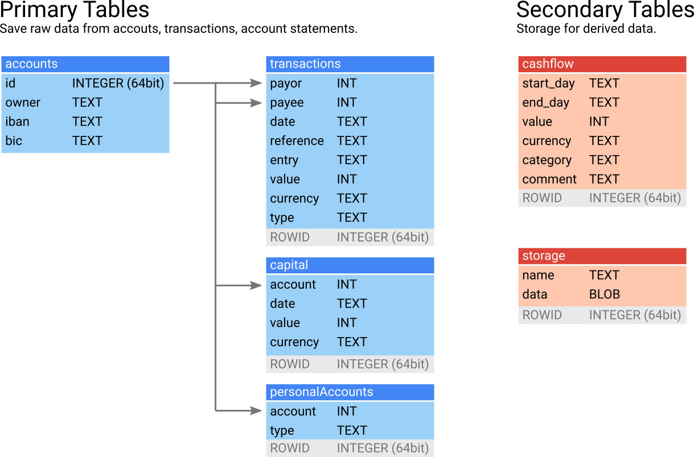

# abacus

**Collect and classify personal cash flows in a database contained in one file.**

1. SQLite database for storing transactions, and functions for accessing it
2. Machine Learning functions for predicting new transactions based on old ones
3. Browser-based application interface for ease of use

## 1. SQLite Database

Everything is set up so that one user would have one [SQLite](https://www.sqlite.org/) database.
This should make things easy.
The database schema is shown below.
I wrote some functions for easily accessing the database.
Usually their name says what they do: `Select`, `Insert`, `Update`.
`Create_testDB` creates a test database with 100 accounts, 2 personalAccounts and 1000 transactions.

### Accounts

Holds accounts involved in every transaction and personal accounts.
Their IDs are used in the other tables as shown.
*personalAccounts* only holds you own accounts.
I made an extra table for that because personal accounts are used more frequently and need one more column.
Since *accounts* will get very big I thoughts its worth it creating an extra table.

### Transactions

Actual transactions with all the information used by your bank.
Column *type* is a label, which will be used by the classifier (see 2. Machine Learning).
In principle this could already be used to create cashflows.
However, I thought 1. it might be useful to aggregate the labels further and 2. that cash withdrawals need to be handled seperately.
Say cash withdrawals are always labelled as *cash withdrawal*.
Sometimes it might be useful to separate a cash withdrawal into different labels to be more precise.
Therefore there is another table *cashflow*.

### Cashflow

The *cashflow* table is mainly derived from *transactions*.
Transactions are mainly aggregated into time intervalls.
It appears a little overkill to have an extra table for that, but I thought the web-app will use this information very often 
and it would be unnecessary to always compute it from the main *transactions* table.
One might also want to aggregat a few labels.
Therefore, the corresponding column is called *category* in this table.
Also, one might want to split labels from transactions into more categories (e.g. a cash withdrawal).
If this happens another column (*comment*) can store the original label.

### Capital

This is for holding actual balances at certain time points.
This should not be needed if all transactions are thoroughly entered.
However, once cash is involved this never happens.
So, this can be used as a sanity check.

### Storage

This table hold objects which are used by the *abacus* package.
These objects can change and are specific to the database.
Therefore, they have their own table.
The objects are serialized for saving.
They can be accessed with the `SelectBLOB`, `InserBLOB`, `UpdateBLOB` functions.
These objects are:

* Params: Hyperparameters of the classifier
* Model: Fitted model of the classifier
* FeatureList: Data.frame of features used by classifier
* Settings: All kinds of setting used by the application

## 2. Machine Learning

The idea is that you upload new transactions and the program automatically labels them correctly and updates its database.
For that I use a supervised solution.
So, the first transactions you enter, have to be labelled manually.
Then, after 100 transactions or so the program learned enough that it can automatically assign labels.
It will always show you the predictions first so you can correct them in case they are wrong.
To do that I wrote some functions that will first extract features from all the information a transaction holds.
Then, a machine learning method is deployed. 
I went with [shrinkage discriminant analysis](https://cran.r-project.org/web/packages/sda/sda.pdf) 
-- simply because I have had good experience with that.

### Feature Extraction

This reads reads all the information in a table of transactions and creates an analytics base table (abt) from it.
This is a matrix with rows as observations (transactions) and columns as features.
The abt is then used by the shrinkage discriminant analysis (sda).
Features include among others owner name and bank of payor and payee, transaction value, reference and booking text.
The function `FeatureExtraction` does that.
It creates the abt and also returns a data.frame which describes the features of the abt.
A sda needs continuous values and most of the features are not continuous.
Currently, I transform these values into binaries, so the abt is filled with 0's and 1's.
This is not exactly elegant, but hey it works!

### sda

This is a regularized linear discriminant analysis (in case you wondered).
For the nature of the features I have, there are probably more elegant ways.
This was the easiest to implement and it immediately worked.
If I have time I might think about trying out other methods in the future.
For ease of use I wrote the `Training`, `Prediction` and `CV` functions.
The `Convert` function is for bringing an arbitrary abt into the correct form for a prediction.
Basically they all just use the [sda package](https://cran.r-project.org/web/packages/sda/sda.pdf).

### S3 Procedures

To have all the steps needed for main tasks of this program 
-- updating and evaluating the predictor, extracting an abt from new transactions and making a prediction --
I wrote some procedures.
`Update_Predictor`, `Evaluate_Predictor` are functions with a lot of side effects. 
They do stuff (see doc) and return TRUE.
For a new prediction several functions are needed though.
I wrote them as S3 methods which carry around a *Transactions* object.
It starts with `Read_csv` and ends with `Enter` (everything is cross referenced in doc).

## 3. Shiny 

## Tests

 Package functions can be tested with 
 `test_dir(system.file("tests", "", package = "abacus"))` 
 (uses [testthat](https://github.com/hadley/testthat)).
